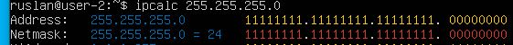
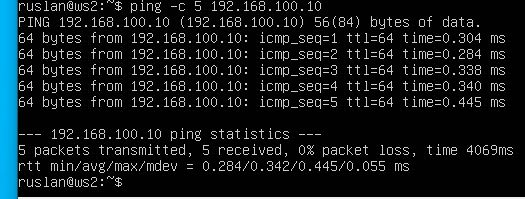
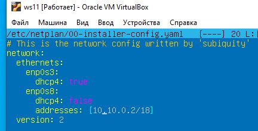
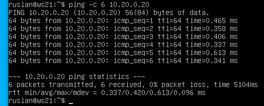
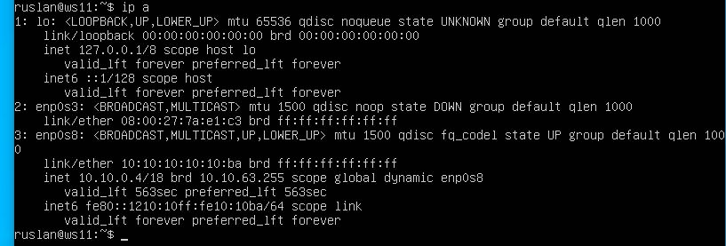
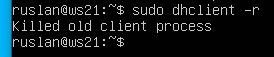
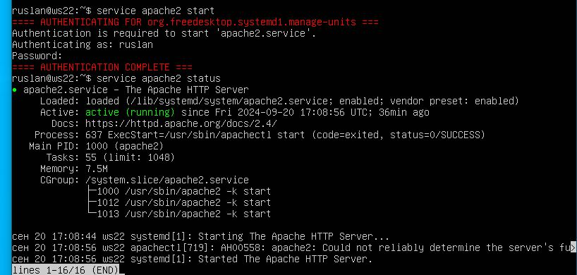

## Part 1. Инструмент ipcalc

<i><b>ipcalc</b> — это утилита, с помощью которой можно выполнять простые операции с адресами IPv4.</i>
-  Установим утилиту, выполнив команду

```bash
sudo apt install ipcalc
```

### 1.1. Сети и маски

-   Адрес сети 192.167.38.54/13<br>
  

- Рарзберем вывод каманды:
  1. Адрес: 192.167.38.54. IP-адрес, который мы предоставили. 
  2. Маска подсети : 255.248.0.0 = 13.
  3. Подстановочный знак : 0.7.255.255. Используется в сетевых устройствах Cisco как часть настроек разрешающего/блокирующего списка.
  4. <b>Адрес сети: 192.168.0.0/13.</b> 
  5. HostMin: 192.160.0.1. Наименьший IP-адрес, который может иметь устройство, подключенное к этой сети.
  6. HostMax: 192.167.255.254. Наибольший IP-адрес, который может иметь устройство, подключенное к этой сети.
  7.  Широковещательный IP: 192.167.255.255. Это широковещательный адрес. Пакеты, отправленные на этот IP-адрес, передаются на все устройства в подсети.
  8. Хосты/Сеть: 524286. Максимальное количество устройств, которые можно подключить к этой подсети.
  9. Класс сети: Класс C, частный интернет

- Перевод маски 255.255.255.0 в префиксную и двоичную запись:
  - префиксная: /24
  - двоичная: 11111111.11111111.11111111.00000000<br>
  


- /15 в обычную и двоичную:
  - обычная: 255.254.0.0
  - двоичная: 11111111.11111110.00000000.00000000<br>
  


- 11111111.11111111.11111111.11110000 в обычную и префиксную:
  - префиксная: /28 (считаем сумму всех единиц в бинарном представлении)
  - обычная: 255.255.255.240 <br>
  

- Минимальный и максимальный хост в сети 12.167.38.4 при масках: 
  - /8 <br> 

  - 11111111.11111111.00000000.00000000 (/16) <br>
    
  - 255.255.254.0 (/24) <br>
    
  - /4 <br>
  

  ### 1.2. localhost
- localhost (так называемый, «местный» от англ. local, или «локальный хост», по смыслу — этот компьютер) — в компьютерных сетях, стандартное, официально зарезервированное доменное имя для частных IP-адресов в диапазоне 127.0.0.1 — 127.255.255.254.

- Определи можно ли обратиться к приложению, работающему на localhost, со следующими IP: 
    - 194.34.23.100 - нельзя <br>
  
    - 127.0.0.2 - можно, присутсвует отметка "Loopback" <br>
  
    - 127.1.0.1 - можно, отметка "Loopback" <br>
  
    - 128.0.0.1 - нельзя <br>
  

    ### 1.3. Диапазоны и сегменты сетей
- Существует разделение IP-адресов на «частные» и «публичные». Под частные (они же локальные сети) сети зарезервированы следующие диапазоны адресов:
  - 10.0.0.0 — 10.255.255.255 (10.0.0.0/8);
  - 172.16.0.0 — 172.31.255.255 (172.16.0.0/12);
  - 192.168.0.0 — 192.168.255.255 (192.168.0.0/16);
  - 127.0.0.0 — 127.255.255.255 (зарезервировано для петлевых интерфейсов (не используется для обмена между узлами сети), т. н. localhost).
- Какие из перечисленных IP можно использовать в качестве публичного, а какие только в качестве частных:
  - 10.0.0.45 - Private <br>

  - 134.43.0.2 - Public <br>

  - 192.168.4.2 - Private <br>

  - 172.20.250.4 - Private <br>

  - 172.0.2.1 - Public <br>

  - 192.172.0.1 - Public <br>

  - 172.68.0.2 - Public <br>

  - 172.16.255.255 - Private <br>

  - 10.10.10.10 - Private <br>

  - 192.169.168.1 - Public <br>


- Какие из перечисленных IP-адресов шлюза возможны у сети 10.10.0.0/18?
    - Возможные IP адреса находятся в диапазоне между HostMin и HostMax <br>
  
    - 10.0.0.1 - возможен
    - 10.10.0.2 - возможен
    - 10.10.10.10 - возможен
    - 10.10.100.1 - не возможен
    - 10.10.1.255 - не возможен

## Part 2. Статическая маршрутизация между двумя машинами

<i><b>Статическая маршрутизация</b> — это способ задания маршрута следования пакетов в сетях, при котором не используются протоколы маршрутизации, а необходимая информация заносится системным администратором вручную в соответствующие таблицы маршрутизации.</i>

- Запустим две виртуальные машины (далее -- ws1 и ws2).<br>
  

- С помощью команды ip a посмотри существующие сетевые интерфейсы.<br>
  
  

- Опиши сетевой интерфейс, соответствующий внутренней сети, на обеих машинах и задай следующие адреса и маски: ws1 — 192.168.100.10, маска /16, ws2 — 172.24.116.8, маска /12. Используй для этих целей файл etc/netplan/00-installer-config.yaml<br>
  
<i>Файл 00-installer-config.yaml содержит настройки сетевых интерфейсов. Пример организации файла и возможные параметры описаны в [статье](https://www.dmosk.ru/miniinstruktions.php?mini=network-netplan). </i>

- При помощи редактора записываем значения ip адресов в файл etc/netplan/00-installer-config.yaml .
- Выводим на экран содержимое измененных файлов
- Выполняем команду netplan apply для перезапуска сервиса сети<br>
  <br>
  

### 2.1. Добавление статического маршрута вручную
- Добавь статический маршрут от одной машины до другой и обратно при помощи команды вида ip r add.
- Пропингуй соединение между машинами.

```bash
sudo ip r add 172.24.116.8 dev enp0s3
```

```bash
ping 172.24.116.8
```


```bash
sudo ip r add 192.168.100.10 dev enp0s3
```

```bash
ping 192.168.100.10
```


### 2.2. Добавление статического маршрута с сохранением

- Перезапускаем машины:
```bash
reboot
```
- Добавь статический маршрут от одной машины до другой с помощью файла /etc/netplan/00-installer-config.yaml.<br>
  <br>
  

- Пропингуй соединение между машинами.<br>
  
  

## Part 3. Утилита iperf3

<i><b>iperf3</b> — это программа для измерения пропускной способности сети в реальном времени.
Является одним из инструментов для тестирования максимально достижимой пропускной способности в IP-сетях (поддерживает IPv4 и IPv6).
</i>

- Перед установкой iperf3 необходимо выаполнить следующще на обеих машинах:
  - Включить в настройках машин второй сетевой адаптер:<br>
  
  
  - Внести корректировку в yaml файл обеих машин, указав настройки для первого сетевого адаптера, чтобы была возможность загрузить на машины iperf3:<br> 
  
  
  - Обновляем настройки:
```bash
sudo netplan apply
```
  - Устанавливаем на обе машины iperf3
```bash
sudo apt install iperf3
```
  ### 3.1. Скорость соединения
  - 8 Mbps= 1 MB/s
  - 100 MB/s = 800000 Kbps
  - 1 Gbps = 1000000 Mbps
  ### 3.2. Утилита iperf3
  - Чтобы измерить скорость нам нужно создать клиент и сервер.
  
  - Чтобы создать сервер на ws2 введем:
  ```bash
  iperf3 -s
  ```
  - Чтобы послать запросы на сервер ws2, на ws1  введем:<br>


## Part 4. Сетевой экран
### 4.1. Утилита iptables
<i><b>Iptables</b> может отслеживать состояние соединения и перенаправлять, изменять или отфильтровывать пакеты, основываясь не только на данных из их заголовков (источник, получатель) или содержимом пакетов, но и на основании данных о соединении.</i>

- Создай файл /etc/firewall.sh, имитирующий файрвол, на ws1 и ws2:
  - ws1<br>
  
  - ws2<br>
  

- Запусти файлы на обеих машинах командами chmod +x /etc/firewall.sh и /etc/firewall.sh.
  - ws1<br>
  
  - ws2<br>
  

- В iptables правила выполняются сверху вниз. Разница в том, что в ws1 пинг будет запрещен и при обращении к этому устройству мы получим ответ что устройство не доступно, так как запрет стоит первым, а в ws2 будет разрешен, так как разрешение стоит первым. Итак, ws1 будет не доступен, а ws2 - доступен.

### 4.2. Утилита nmap
<i><b>Nmap</b> — это инструмент командной строки Linux для исследования сети и проверки безопасности. Особенностью nmap является то, что эта утилита может определить, включен ли хост, даже если его нельзя пропинговать.</i>
- Командой ping найди машину, которая не «пингуется», после чего утилитой nmap покажи, что хост машины запущен.
  - ws1 не пингуется, пакеты потеряны:<br>
  
   - ws2 пингуется, потерь пакетов нет:<br>
  
  
- Команда nmap:
  - ws1<br>
  
  - ws2<br>
  

  ## Part 5. Статическая маршрутизация сети
 - Сеть: 
  

- В менеджере Virtual box клонированием создаем пять машин<br>
  
- Переходим в настройки сети каждой машины и вносим настройки:
    - r1:
      - Адаптер 1: NAT
      - Адаптер 2: Внутренняя сеть, Имя - intnet1
      - Адаптер 3: Внутренняя сеть, Имя - intnet2
    - r2:
      - Адаптер 1: NAT
      - Адаптер 2: Внутренняя сеть, Имя - intnet2
      - Адаптер 3: Внутренняя сеть, Имя - intnet3
    - ws11:
      - Адаптер 1: NAT
      - Адаптер 2: Внутренняя сеть, Имя - intnet1
    - ws21, ws22:
      - Адаптер 1: NAT
      - Адаптер 2: Внутренняя сеть, Имя - intnet3

- Запускаем каждую машину и устанавливаем соотвествующие hostname
### 5.1. Настройка адресов машин
- Согласно схеме сети прописываем настройки в файл etc/netplan/00-installer-config.yaml для каждой машины:
  - r1<br>
  
  - r2<br>
    
  - ws11<br>
    
  - ws21<br>
    
  - ws22<br>
    
- Перезапускаем сервисы:
```bash
sudo netplan apply
```
-  Командой ip -4 a проверь, что адрес машины задан верно:
   - r1<br>
  
   - r2<br>
  
   - ws11<br>
  
   - ws21<br>
  
   - ws22<br>
  

-  Проверка:
   - пинг ws22 с ws21<br>
  
   - пинг r1 с ws11<br>
  
  
  ### 5.2. Включение переадресации IP-адресов
  - Для включения переадресации IP выполни команду на роутерах:
```bash
sudo sysctl -w net.ipv4.ip_forward=1
```
- При таком подходе переадресация не будет работать после перезагрузки системы.
  - r1<br>
  
   - r2<br>
  

- Открой файл /etc/sysctl.conf и добавь в него следующую строку:
```bash
net.ipv4.ip_forward = 1
```
 - При использовании этого подхода, IP-переадресация включена на постоянной основе.
    - r1<br>
  
     - r2<br>
  

  ### 5.3. Установка маршрута по умолчанию
- Настрой маршрут по умолчанию (шлюз) для рабочих станций, добавив в файлы etc/netplan/00-installer-config.yaml нужные параметры. Добавь default перед IP-роутера в файле конфигураций:
    - ws11<br>
  
     - ws21<br>
  
    - ws22<br>
  

- Вызови ip r и покажи, что добавился маршрут в таблицу маршрутизации.
  - ws11<br>
  
  - ws21<br>
  
  - ws22<br>
  

- Пропингуй с ws11 роутер r2 и покажи на r2, что пинг доходит. Для этого используй команду на r2:<br>
```bash
tcpdump -tn -i eth0
```
<i><b>tcpdump</b> — это программа-сниффер (анализатор сетевого трафика), которая позволяет перехватывать и анализировать проходящий через утилиту сетевой трафик.</i>

- Запустим ping на ws1:<br>
  
- После запска ping на r2 увидим что сообщение дошло:<br>
  

  ### 5.4. Добавление статических маршрутов

- Добавь в роутеры r1 и r2 статические маршруты в файле конфигураций. Пример для r1 маршрута в сетку 10.20.0.0/26:
```bash
- to: 10.20.0.0
  via: 10.100.0.12
```
 

  

- Вызови ip r и покажи таблицы с маршрутами на обоих роутерах:
    - r1<br>
  
     - r2<br>
  

- Запусти команды на ws11:<br>
```bash
ip r list 10.10.0.0/18
```

```bash
ip r list 0.0.0.0/0
```


- Для адреса 10.10.0.0/18 был выбран маршрут, отличный от 0.0.0.0/0 (он попадает под маршрут по-умолчанию), т.к. машина ws11 соединена с сетью 10.10.0.0/18 по своему IP-адресу 10.10.0.2, для других адресов используется маршрут по умолчанию, который указан в файле 10.10.0.1.

### 5.5. Построение списка маршрутизаторов
  - Запустим на r1 команду дампа:
```bash
tcpdump -tnv -i enp0s8
```
-n - не конвертировать адреса в имена;<br>
-t - не выводить время при выводе каждой строкчи дампа;<br>
-v - при синтаксическом анализе и выводить более подробную информацию. Например, печатаются время создания, общая длина и параметры IP-пакета. Также включает дополнительные проверки целостности пакетов, такие как проверка контрольной суммы заголовка IP и ICMP.

- Не прерывая команду дампа, выполним на ws11 команду:
```bash
traceroute
```
<i><b>Traceroute или Tracert</b> – это утилита, служащая для диагностики сети. Она отслеживает пути, по которым пакеты данных проходят от источника к хосту назначения, что позволяет администраторам оперативно решить проблемы с подключением.</i>
- Командная строка на r1:<br>

- Список маршрутизаторов на пути ws11 - ws21:<br>


<i><b>Как работает traceroute</b><br>
<p>Утилита отслеживает, на какие узлы попадает сетевой пакет в процессе его передачи на целевой хост. По умолчанию используется UDP
 протокол – формируется UDP датаграмма, которая упаковывается в IP пакет. В одном из заголовков этого пакета утилита устанавливает значение параметра TTL (Time To Live) равным 1. Этот параметр используется для ограничения количества переходов от одного маршрутизатора к другому, т.е. позволяет избежать бесконечной передачи пакета между маршрутизаторами (например, в случае некорректно настроенного протокола динамической маршрутизации, или при ошибках в статических маршрутах). Каждый маршрутизатор, получив пакет, уменьшает значение TTL на 1 перед отправкой далее в сеть. В ситуации, когда после очередного уменьшения TTL становится равным 0 пакет считается недоставленным и отбрасывается, при этом маршрутизатор отвечает отправителю сообщением об ошибке.
</p>
<p>
При TTL = 1 traceroute, получая ответ от первого маршрутизатора, определяет его IP адрес и время, затраченное на обработку пакета. После этого TTL увеличивается на единицу для определения следующего маршрутизатора, и так далее до момента попадания пакета на целевой хост. Утилита использует указанный ей IP-адрес, и порт 34434 по умолчанию. Целевой хост принимает пакет, и отправляет сообщение о недоступности порта 34434 (так как в большинстве случаев он не используется каким-либо сервисом и закрыт). В итоге отслеживается вся цепочка следования пакета, которая завершается ответом от целевого хоста.
</p>
<p>
Маршрутизатором является любое устройство, передающее пакет из одной подсети в другую — это может быть какой-либо сервер, а не специализированное сетевое устройство. Это особенно актуально для микросервисной архитектуры приложений, использующей технологии контейнеризации. Анализируя время, затраченное на переход от одного маршрутизатора к другому, можно определить на каком из них возникает задержка – возможно из-за нехватки ресурсов на одном из серверов, или из-за неисправности дисковой системы, и др. Если один из серверов недоступен, то пакет не дойдет до целевого хоста, и утилита определит на каком этапе передачи это происходит. Также, пакет не дойдет если действует фильтрация трафика, мешающая передачи пакета.</p></i>

- На основании вывода tcpdump на r1, видно, что каждый маршрутизатор последовательно отвечает на пакеты traceroute, предоставляя информацию о своем IP-адресе и времени задержки (RTT).

### 5.6. Использование протокола ICMP при маршрутизации
<i><b>ICMP (Internet Control Message Protocol)</b> — это вспомогательный протокол в пакете Internet protocol suite.

Он используется сетевыми устройствами, включая маршрутизаторы, для отправки сообщений об ошибках и оперативной информации, указывающей на успех или сбой при общении с другим IP-адресом.</i>
- Запусти на r1 перехват сетевого трафика, проходящего через enp0s8:<br>
```bash
tcpdump -n -i enp0s8 icmp
```
- Непрерывая выполнение на r1 пропингуй с ws11 несуществующий IP с помощью команды<br>
```bash
ping -с 4 10.8.5.4
```
- r1:<br>

- ws11:<br>


- В командной строке r1 видно, что ws11 отправил 4 пакета на ip адрес 10.8.5.4. 

- Сохраним дампы образов виртуальных машин.<br>


## Part 6. Динамическая настройка IP с помощью DHCP
<i><b>DHCP</b> — протокол прикладного уровня модели TCP/IP, служит для назначения IP-адреса клиенту.
IP-адрес можно назначать вручную каждому клиенту, то есть компьютеру в локальной сети.
Но в больших сетях это очень трудозатратно, к тому же, чем больше локальная сеть, тем выше возрастает вероятность ошибки при настройке.
Поэтому для автоматизации назначения IP был создан протокол DHCP.
</i>
### Для r2 настрой в файле /etc/dhcp/dhcpd.conf конфигурацию службы DHCP:
1. Укажи адрес маршрутизатора по умолчанию, DNS-сервер и адрес внутренней сети. Пример файла для r2:
```bash
subnet 10.100.0.0 netmask 255.255.0.0 {}

subnet 10.20.0.0 netmask 255.255.255.192
{
    range 10.20.0.2 10.20.0.50;
    option routers 10.20.0.1;
    option domain-name-servers 10.20.0.1;
}

```


2. В файле /etc/resolv.conf пропиши nameserver 8.8.8.8.<br>


- Перезагрузи службу DHCP командой systemctl restart isc-dhcp-server:<br>


- Для получения адреса по DHCP изменим файл etc/netplan/00-installer-config.yaml:<br>


- Машину ws21 перезагрузи при помощи reboot и через ip a покажи, что она получила адрес:<br>


- Пропингуй ws22 с ws21:<br>


- Укажи MAC-адрес у ws11, для этого в etc/netplan/00-installer-config.yaml надо добавить строки: macaddress: 10:10:10:10:10:BA, dhcp4: true.<br>


- Указываем MAC-адрес в настройках адаптера виртуальной машины:<br>


### Для r1 настрой аналогично r2, но сделай выдачу адресов с жесткой привязкой к MAC-адресу (ws11). Проведи аналогичные тесты.<br>

1. Укажи адрес маршрутизатора по умолчанию, DNS-сервер и адрес внутренней сети:<br>


2. В файле /etc/resolv.conf пропиши nameserver 8.8.8.8.<br>


- Перезагрузи службу DHCP командой systemctl restart isc-dhcp-server:<br>


- Машину ws11 перезагрузи при помощи reboot и через ip a покажи, что она получила адрес:<br>


- Пропингуем чтобы проверить работу:
   - ws11 - ws22<br>

  - ws21 - ws11<br>


### Запроси с ws21 обновление IP-адреса.
- ip ws21 до обновления:<br>


- Запросим с ws21 обновление ip адреса с помощью команды:
```bash
sudo dhclient -v
```
-v - будет выведена дополнительная информация.<br>


- Выполним команду ip a. Вывод содержит два ip адреса (старый и новый):<br>


- Освободим старый ip адрес:<br>


- Проверим ip:<br>


- В части 6 были использованы следующие опции DHCP протокола:<br>
  - range: диапазон выдаваемых IP-адресов.
  - option routers: адрес маршрутизатора по умолчанию.
  - option domain-name-servers: адрес DNS-сервера.

- Сохрани дампы образов виртуальных машин.<br>

## Part 7. NAT
**SNAT** и **DNAT**

**NAT** — аббревиатура для «Network Address Translation», т.е. «преобразование сетевых адресов».  
**NAT** возникает в случае, когда один из IP-адресов меняется в заголовке IP-пакета: либо IP-адрес источника, либо IP-адрес получателя.


Параметр |	**SNAT**|	**DNAT**
---------|----------|-----------
Расшифровка аббревиатуры |Source **NAT**|Destination **NAT**
Терминология|**SNAT** меняет частный IP-адрес узла-источника на публичный IP-адрес. Также может изменить порт источника в заголовках TCP/UDP. Обычно **SNAT** используется внутренними пользователями для доступа в Интернет.|Destination **NAT** изменяет адрес назначения в заголовке IP-пакета. Он также может изменить порт назначения в заголовках TCP/UDP. **DNAT** используется, когда нам нужно перенаправить входящие пакеты с публичным адресом/портом назначения на частный IP-адрес/порт внутри нашей сети.
Сценарий использования |Клиент внутри локальной сети и закрытый файерволлом хочет получить доступ к сети Интернет.|Веб-сайт, развернутый внутри некоего дата центра и расположенный за файерволлом, должен быть доступен для пользователей Интернета. 
Изменение адреса|**SNAT** изменяет адрес источника пакетов, передаваемых через устройство **NAT**.|**DNAT** изменяет адрес назначения пакетов, передаваемых через маршрутизатор.
Порядок выполнения|**SNAT** выполняется после принятия решения о маршрутизации.|**DNAT** выполняется до принятия решения о маршрутизации.
Порядок общения|**SNAT** возникает, когда внутренняя защищенная сеть начинает взаимодействовать с внешним миром.|**DNAT** возникает, когда внешняя незащищенная сеть инициирует взаимодействие с внутренней защищенной сетью.
Один/несколько хостов|**SNAT** позволяет нескольким хостам во «внутренней» сети добраться до любого хоста во «внешней» сети.|**DNAT** позволяет любому хосту во «внешней» сети добраться до одного хоста во «внутренней» сети.


### В файле /etc/apache2/ports.conf на ws22 и r1 измени строку Listen 80 на Listen 0.0.0.0:80, то есть сделай сервер Apache2 общедоступным:

<i><b>Apache («Апачи», Apache HTTP Server)</b> — это открытое кросс-платформенное программное обеспечение для размещения и поддержки веб-сервера.</i>

  - r1:<br>

  
  - ws22:<br>


### Запусти веб-сервер Apache командой service apache2 start на ws22 и r1:
  - r1:<br>

  
  - ws22:<br>


### Добавь в фаервол, созданный по аналогии с фаерволом из Части 4, на r2 следующие правила:

1) Удаление правил в таблице filter — iptables -F;

2) Удаление правил в таблице «NAT» — iptables -F -t nat;

3) Отбрасывать все маршрутизируемые пакеты — iptables --policy FORWARD DROP.<br>
   


### Запусти файл также, как в Части 4.

- Запустим файл командами:
```bash
sudo chmod +x /etc/firewall.sh
```
```bash
sudo bash /etc/firewall.sh
```


### Проверь соединение между ws22 и r1 командой ping.
<i>При запуске файла с этими правилами, ws22 не должна «пинговаться» с r1.</i>

- Ping соединение между r1 и ws22:<br>


- Ping соединение между ws22 и r1:<br>


### Добавь в фаервол ещё одно правило:

4) Разрешить маршрутизацию всех пакетов протокола ICMP.<br>


### Запусти файл также, как в Части 4.


### Проверь соединение между ws22 и r1 командой ping.
<i>При запуске файла с этими правилами, ws22 должна «пинговаться» с r1.</i>

- Ping соединение между r1 и ws22:<br>


- Ping соединение между ws22 и r1:<br>


### Добавь в файл ещё два правила:

5) Включи SNAT, а именно маскирование всех локальных IP из локальной сети, находящейся за r2 (по обозначениям из Части 5 — сеть 10.20.0.0).<br>

6) Включи DNAT на 8080 порт машины r2 и добавить к веб-серверу Apache, запущенному на ws22, доступ извне сети.<br>


### Запусти файл также, как в Части 4.
<i>Перед тестированием рекомендуется отключить сетевой интерфейс NAT (его наличие можно проверить командой ip a) в VirtualBox, если он включен.</i>

### Проверь соединение по TCP для SNAT: для этого с ws22 подключиться к серверу Apache на r1 командой:<br>
```bash
telnet [адрес] [порт]
```
<i>Протокол <b>telnet</b>, созданный на основе TCP, позволяет передавать на удаленный сервер простые текстовые команды для ручного управления процессами и включения взаимодействия между ними.</i>


### Проверь соединение по TCP для DNAT: для этого с r1 подключиться к серверу Apache на ws22 командой telnet (обращаться по адресу r2 и порту 8080):<br>


### Сохрани дампы образов виртуальных машин.

## Part 8. Дополнительно. Знакомство с SSH Tunnels

<i><p><b>SSH (secure shell - безопасная оболочка)</b> – это защищенный сетевой протокол для удаленного управления сервером через интернет в безопасном режиме. В основе протокола SSH лежит криптография - шифрование канала связи.</p>
<p>
Иными словами, SSH позволяет выстроить так называемый <b>SSH-туннель</b>, на одном конце которого данные шифруются и отправляются, а на другом конце - принимаются и расшифровываются. По туннелю данные передвигаются зашифрованными.</p></i>

### Запусти на r2 фаервол с правилами из Части 7:


### Запусти веб-сервер Apache на ws22 только на localhost (то есть в файле /etc/apache2/ports.conf измени строку Listen 80 на Listen localhost:80)<br>
<br>

### Воспользуйся Local TCP forwarding с ws21 до ws22, чтобы получить доступ к веб-серверу на ws22 с ws21.

<i>Local TCP forwarding (локальная переадресация TCP) — это механизм SSH, который позволяет вам перенаправлять трафик с локального порта на вашем компьютере через защищённое SSH-соединение на удалённый сервер и дальше на целевую систему, к которой вы хотите подключиться.</i>

Как это работает:
Клиент SSH (ваш локальный компьютер) прослушивает определённый локальный порт.
Когда вы подключаетесь к этому порту, SSH-клиент туннелирует ваш запрос через SSH-соединение на удалённый сервер.
Сервер SSH (удалённый сервер, к которому подключается ваш клиент SSH) получает этот запрос и перенаправляет его на указанный удалённый сервер и порт.
Результат передаётся обратно через туннель, и вы получаете доступ к целевой системе через защищённое соединение.
 - Пробрасывать порт от сервера будем по следующему алгоритму:

   - ws22: создадим соединение с машины ws22, на которой установлен сервер ssh, с машиной ws 21.
   - ws22: с помощью команды ssh -L прокинем "прямое" соединение с машины ws21 на машину ws22.

- Проверим запущенные SSH, процессы связанные с sshd до запуска туннеля:<br>


- Создаём ssh соединение. Запускаем на машине ws22<br>


- Видим, что мы подключились к машине ws21, оставаясь на машине ws22, устанавливаем соединение с сервером ws22 от машины ws21<br>

- Проверяем процессы на машине ws22 после создания соединения<br>


- На машине ws21 запускаем утилиту telnet<br>


- Видим что соединение установлено, в поле сервер прописан использованный нами apache2


### Воспользуйся Remote TCP forwarding c ws11 до ws22, чтобы получить доступ к веб-серверу на ws22 с ws11.

<i>Remote TCP forwarding (удалённая переадресация TCP) — это механизм SSH, который позволяет вам перенаправлять трафик с порта на удалённой машине (сервере SSH) на ваш локальный или другой удалённый компьютер через защищённое SSH-соединение.

В отличие от Local TCP forwarding, где трафик перенаправляется с локального компьютера на удалённый, при Remote TCP forwarding инициатором является удалённый сервер. То есть, трафик, поступающий на удалённый порт сервера SSH, передаётся на локальный или другой компьютер через SSH-туннель.</i>

- Из-за того что на роутере r2 настроен firewall, подключиться к серверу Apache на машине ws22 с помощью команды ssh -L, с машины ws11, не получится (роутер r2 не пропустит команду). В этом случае необходимо воспользоваться командой ssh -R. Выполнить её необходимо на машине ws22. Это выполняется за несколько шагов:<br>

   - На машине ws11: На машине ws11: переход с машины ws11 на роутер r2 с помощью ssh (роутер не позволит сразу перейти на машину ws22);<br>
   - На машине ws11: переход с роутера r2 на машину ws22 с помощью ssh;<br>
  - На машине ws11: проброс туннеля с машины ws22 на машину ws11 с помощью ssh -R;<br>

- Создаём ssh соединение между ws11 и r2. Запускаем на машине ws11:<br>
``` bash 
ssh 10.100.0.12 
```


- Далее находясь физически на той же машине ws11 с именем хоста r2, создаем ssh соединение r2 и ws22:<br>
``` bash 
10.20.0.20
```


- В предыдущем задании на роутере r2 был настроен на fireWall, который не пропускает проходящие пакеты из другой сети. Поэтому сначала необходимо пробросить тунель от ws22 к ws11. Для этого запускаем на машине ws11 команду:<br>
``` bash 
ssh -R 10.10.0.2:8080:127.0.0.1:80 10.10.0.2
```


- Для проверки, сработало ли подключение, переходим во второй терминал (для этого находясь в терминале машины ws11 нажимаем ctrl+alt+F2) и выполяем команду (telnet 127.0.0.1 [локальный порт]). В момент выполнения данной команды необходимо нажать любую клавишу<br>
``` bash 
telnet 127.0.0.1 8080
```


- Видим что соединение установлено, в поле сервер прописан использованный нами apache2<br>
